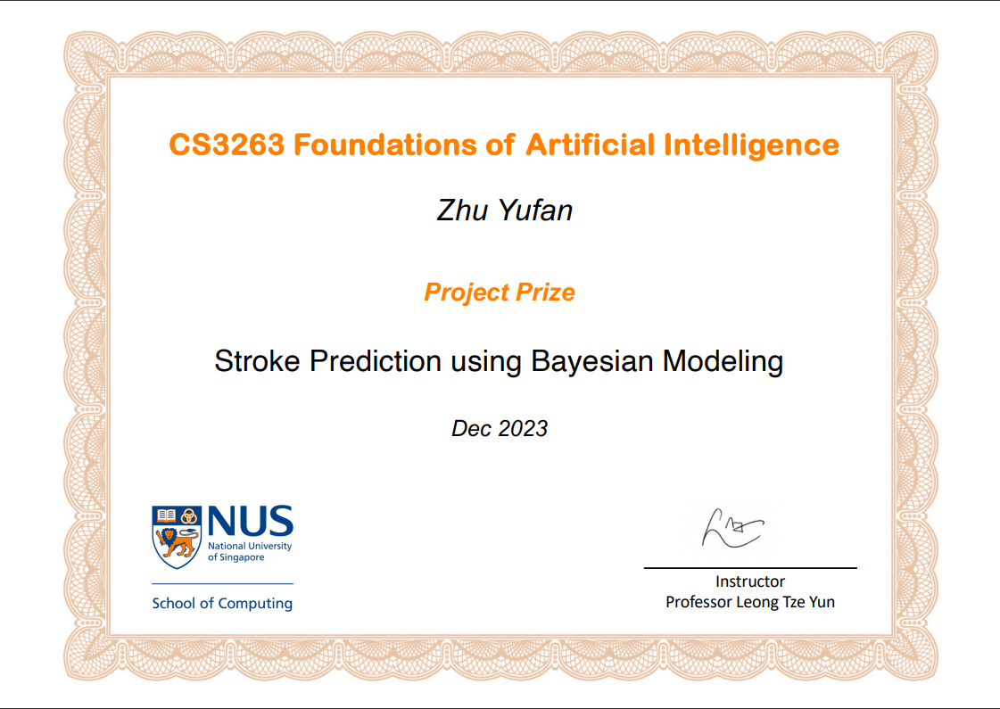

# Stroke Prediction


Stroke Prediction is a project that aims to predict the likelihood of a stroke based on various input features such as age, gender, health conditions, and lifestyle factors. The model is built using a Bayesian Network and trained on data sourced from Kaggle. This README provides a comprehensive guide on how to set up, train, and verify the model.

This project has also won the Best Project Award amount all the teams for NUS CS3264, Foundation of Artificial Intelligence.




Please refer to the [full report](docs/Report.pdf) for more information about the tool and the model.

## Table of Contents
- [Dataset](#dataset)
- [Installation](#installation)
- [Usage](#usage)
- [Files in the Repository](#files-in-the-repository)

## Dataset

The dataset used for this project is sourced from [Kaggle](https://www.kaggle.com/datasets/fedesoriano/stroke-prediction-dataset). It includes features like age, gender, hypertension, heart disease, marital status, work type, residence type, glucose level, BMI, and smoking status.

## Installation

1. Clone the repository:
   ```
   git clone <repository-url>
   ```

2. Navigate to the project directory:
   ```
   cd Stroke-Prediction
   ```

3. Install the necessary Python libraries:
   ```
   pip install -r requirements.txt
   ```

## Usage

1. **Data Cleaning**: 
   Before training the model, the raw data needs to be cleaned and transformed. Run the `data_cleaner.py` script to process the raw data and generate the `transformed_data.csv` file.
   ```
   python data_cleaner.py
   ```

2. **Training the Model**: 
   Use the `model.py` script to train the Bayesian Network on the transformed data.
   ```
   python model.py
   ```

3. **Model Verification**: 
   To verify the accuracy of the trained model on a test dataset, use the `verifier.py` script.
   ```
   python verifier.py
   ```

4. **Graph Visualization** (Optional):
   If you want to visualize the Bayesian Network, you can use the `graph.py` script.
   ```
   python graph.py
   ```

## Files in the Repository

- `raw.csv`: Raw data sourced from Kaggle.
- `transformed_data.csv`: Processed data ready for training.
- `data_cleaner.py`: Script to clean and preprocess the raw data.
- `model.py`: Script to train the Bayesian Network.
- `verifier.py`: Script to verify the accuracy of the trained model.
- `graph.py`: Script to visualize the Bayesian Network (optional).
- `requirements.txt`: List of Python libraries required for the project.

